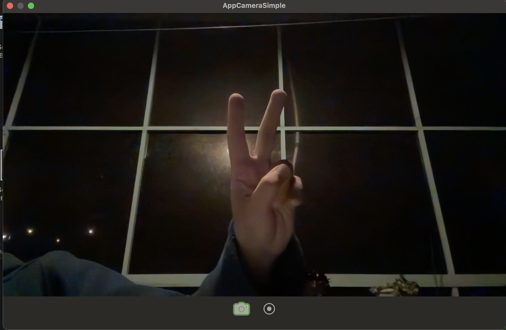

# AppCameraSimple



A minimal native macOS camera app: live preview, photo and video capture.
Files are saved to `~/Pictures/AppCameraSimple/`.

## Run the app (users)

1. Download `AppCameraSimple.app` (тут будет ссылка).
2. Move it wherever you like (e.g. Applications).
3. First launch: right-click the app → **Open** (it's ad-hoc signed, not notarized by Apple, so Gatekeeper shows one warning before the app even starts — this is expected, click Open to proceed).
4. Once the app actually launches, macOS will separately ask for camera access — allow it, that's the normal one-time permission prompt.

## Build from source (developers)

All the source is in this repo and safe to review — no third-party dependencies, only Apple's own frameworks (AppKit, AVFoundation).

Requirements:
- macOS 15+
- Xcode Command Line Tools (provides `swift`, `iconutil`, `codesign`) — install with `xcode-select --install` if `swift --version` doesn't work yet

```
git clone https://github.com/NikolaevMikhailRoma/camera_app.git
cd camera_app
git checkout swift
./build.sh
open AppCameraSimple.app
```

## Roadmap

- Let user pick save folder
- Settings window
- Recording elapsed-time display
- Split recording into clips???
- Cross-platform video format???
- Separate photo/video folders???
- Remove the gray background at the bottom
- Polish, refactor, more tests

## License

MIT — use it however you like.
