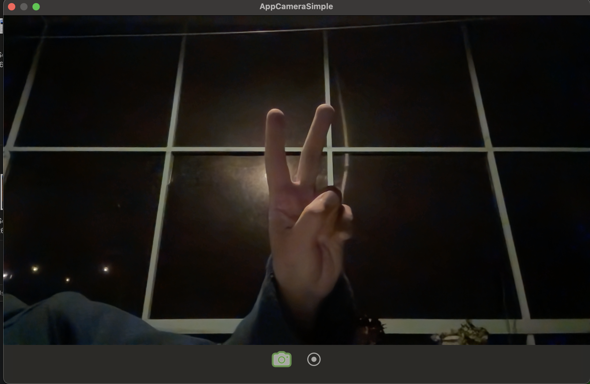
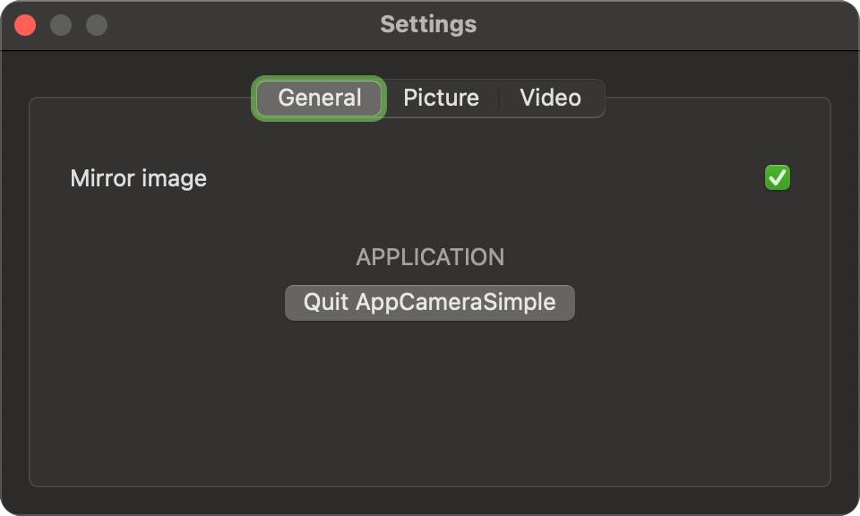
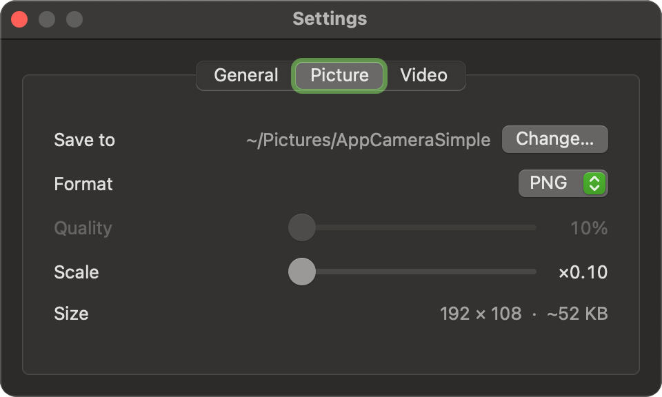
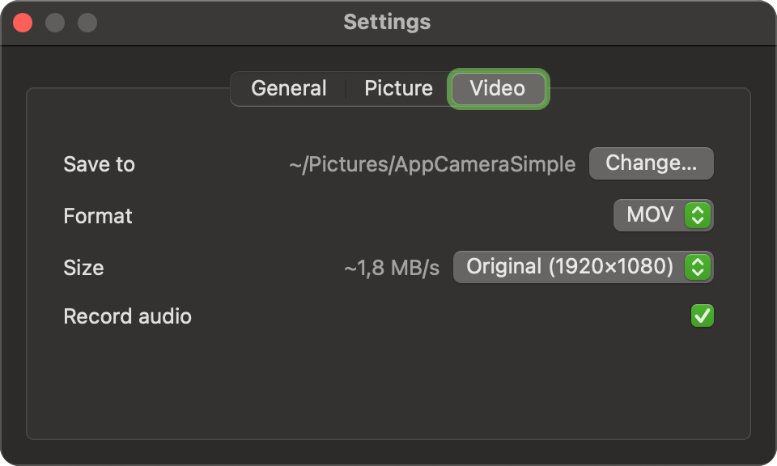

# AppCameraSimple



A minimal native macOS camera app: live preview, photo and video capture. The
image is mirrored left to right, the way a viewfinder normally behaves, and what
you see is what gets saved. Recordings include sound.

Photos and videos are saved to `~/Pictures/AppCameraSimple/` by default.
Settings (⌘,) has three tabs: **General** (mirroring), **Picture** (photo
folder, PNG or JPEG, quality, scale down with a size estimate) and **Video**
(video folder, format, frame size down to 144p with a MB/s estimate, sound).
Photos are PNG, mirroring and sound are on by default.

<p>
  
  
  
</p>

## Run the app (users)

1. Download `AppCameraSimple.app.zip` from the [latest release](https://github.com/NikolaevMikhailRoma/mac-AppCameraSimple/releases/latest) and unzip it.
2. Move it wherever you like (e.g. Applications).
3. First launch: right-click the app → **Open** (it's ad-hoc signed, not notarized by Apple, so Gatekeeper shows one warning before the app even starts — this is expected, click Open to proceed).
4. Once the app actually launches, macOS will separately ask for camera access — allow it, that's the normal one-time permission prompt. The first time you record, it asks for the microphone the same way; deny it and recordings are simply silent.

## Build from source (developers)

All the source is in this repo and safe to review — no third-party dependencies, only Apple's own frameworks.

Requirements:
- macOS 15+
- Xcode Command Line Tools (provides `swift`, `iconutil`, `codesign`) — install with `xcode-select --install` if `swift --version` doesn't work yet

```
git clone https://github.com/NikolaevMikhailRoma/mac-AppCameraSimple.git
cd mac-AppCameraSimple
./build.sh
open AppCameraSimple.app
```

Run the unit tests with `swift test` (pure logic lives in the
`AppCameraSimpleCore` target).

## License

MIT — use it however you like.
